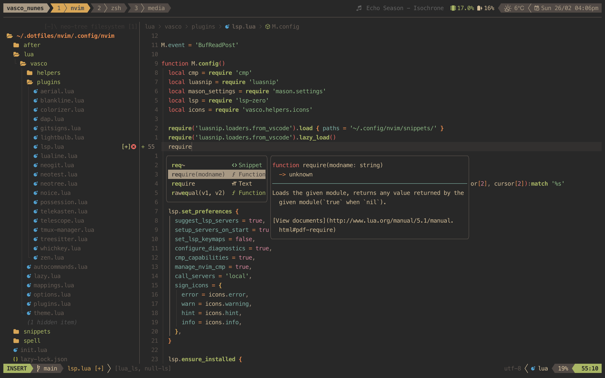

# Vasco's dotfiles

I currently use [Alacritty](https://github.com/alacritty/alacritty) under macOS with
the **Zsh** shell and a configuration based on [zcomet](https://zcomet.io/). My
colour theme is Gruvbox Material Medium and my font is a patched Meslo Nerd
font.

- **Tmux** is my terminal multiplexer
- **Neovim** is my editor of choice
- **Newsboat** for staying updated on my RSS feeds, podcasts, YouTube
  subscriptions
- **ncmpcpp** and **mpd** for my music
- **Vifm** as my file manager
- **w3m** when browsing the internet from the terminal
- **Weechat** for IRC
- **tuir** for all Reddit stuff
- **MPV** for watching videos



This repository uses GNU Stow to handle the dotfiles.

See more information here:
[https://www.gnu.org/software/stow/](https://www.gnu.org/software/stow/)

## Setup script

A setup script is included to handle all the essential setup under macOS:

```bash
./setup.sh
```

## Manual installation

Alternatively, use the below instructions to set up the dotfiles manually.

Under macOS, install `stow` with Homebrew:

```bash
brew install stow
```

To clone the repository on a new machine:

```bash
git clone git@github.com:vascomfnunes/dotfiles.git .dotfiles
```

Then just stow the packages like so:

```bash
cd .dotfiles
stow <package>
```

Where `<package>` is the directory name.

## Alacritty

For changing between dark and light themes please install
alacritty-theme-switch:

```bash
npm install -g alacritty-theme-switch
```

There's a script in `bin` directory that is able to toggle tmux and alacritty
themes, like so:

```bash
theme <light|dark>
```

From Neovim, you can change all of them at the same time using `<leader>C`
followed by `d` for `dark` and `l` for light.

## Neovim

This configuration requires Neovim 0.8.x and uses `Lazy` as the
package manager of choice.

The leader key is set to the `spacebar` key.

It will clone the `Lazy` repo on the first run and install all the plugins.

After that, all defined TreeSitter definitions will be
installed automatically.

LSP clients/Linters/Debuggers are installed automatically and handled by
[Mason](https://github.com/williamboman/mason.nvim).

If you got some error just restart `Neovim` to load the new plugins and
configuration.

### Additional linting and formatting with null-ls

This configuration uses `null-ls` for additional formatting and linting.

## Tmux

After launching Tmux for the first time, install the plugins with `<C-a>I`. Some
plugins require `rust` and cargo support to be installed.

If you're curious, I use a couple of Tmux's status line plugins I wrote:

- **[Clima](https://github.com/vascomfnunes/tmux-clima)** A local weather
  status, fetching data from OpenWeather
- **[Ludanta](https://github.com/vascomfnunes/tmux-ludanta)** A 'what's playing' on a local MPD server
- **[Kripto](https://github.com/vascomfnunes/tmux-kripto)** To watch the prices
  of cryptocurrencies falling :)

## Weechat

### Secured data

To secure the password for the IRC servers:

```weechat
/secure passphrase <pass>
/secure set libera <pass>
```

Useful documentation to use safe Base16 colours:
[https://gist.github.com/zer4tul/80bf7a8783b14cc10449](https://gist.github.com/zer4tul/80bf7a8783b14cc10449)
