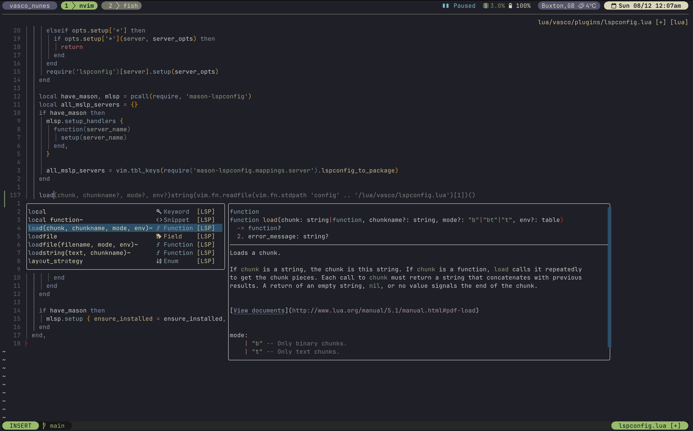

# Vasco's dotfiles

I currently use [iTerm2](https://iterm2.com) under macOS with
the **Fish** shell. My colour theme is Kanagawa and my font is a
patched JetBrains Nerd font.

- **Tmux** is my terminal multiplexer
- **Neovim** is my editor of choice
- **Newsboat** for staying updated on my RSS feeds, podcasts, YouTube
  subscriptions
- **ncmpcpp** and **mpd** for my music
- **Yazi** as my file manager
- **w3m** when browsing the internet from the terminal
- **Weechat** for IRC
- **MPV** for watching videos



This repository uses GNU Stow to handle the dotfiles.

See more information here:
[https://www.gnu.org/software/stow/](https://www.gnu.org/software/stow/)

## Setup script

A setup script is included to handle all the essential setup under macOS:

```bash
./setup.sh
```

## Manual installation

Alternatively, use the below instructions to set up the dotfiles manually.

Under macOS, install `stow` with Homebrew:

```bash
brew install stow
```

To clone the repository on a new machine:

```bash
git clone git@github.com:vascomfnunes/dotfiles.git .dotfiles
```

Then just stow the packages like so:

```bash
cd .dotfiles
stow <package>
```

Where `<package>` is the directory name.

## Fish

Add the fish shell to `/etc/shells`:

```bash
sudo sh -c 'echo /opt/homebrew/bin/fish >> /etc/shells'
```

Restart the terminal and make fish the default shell for the current user:

```bash
chsh -s /opt/homebrew/bin/fish
```

Logout and login again to make sure you're using the new fish shell.

## Neovim

This configuration requires Neovim 0.10.x and uses `Lazy` as the
package manager of choice.

The leader key is set to the `spacebar` key.

It will clone the `Lazy` repo on the first run and install all the plugins.

After that, all defined TreeSitter definitions will be
installed automatically.

LSP clients/Linters/Debuggers are installed automatically and handled by
[Mason](https://github.com/williamboman/mason.nvim).

If you got some error just restart `Neovim` to load the new plugins and
configuration.

## Tmux

After launching Tmux for the first time, install the plugins with `<C-a>I`. Some
plugins require `rust` and cargo support to be installed.

If you're curious, I use a couple of Tmux's status line plugins I wrote:

- **[Clima](https://github.com/vascomfnunes/tmux-clima)** A local weather
  status, fetching data from OpenWeather
- **[Ludanta](https://github.com/vascomfnunes/tmux-ludanta)** A 'what's playing' on a local MPD server
- **[Kripto](https://github.com/vascomfnunes/tmux-kripto)** To watch the prices
  of cryptocurrencies falling :)

## Weechat

### Secured data

To secure the password for the IRC servers:

```weechat
/secure passphrase <pass>
/secure set libera <pass>
```
